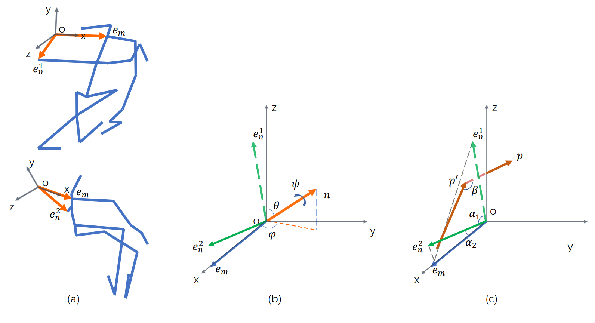

# Advanced Skeleton-Based Action Recognition via Spatial-Temporal Rotation Descriptors
## Overview

**Figure (a)** shows the movement of the joint unit constructed on the shoulder at adjacent sample moments. In **Figure (b)**, angles of bias *θ* and *φ* denote the rotation axis *n*. The linear combination of angles *(θ, φ, ψ)* constructs **Rotation Angles Representation**. In **Figure (c)**, *α<sub>1</sub>, α<sub>2</sub>* are the internal angles between two bones *e<sub>m</sub>* and *e<sub>n</sub>* on the tangential direction and *β* is the angular difference between norm vectors *p*. The angular differences on the tangential and normal directions *α<sub>2</sub> − α<sub>1</sub>* and *β* construct **Two-Directional Difference Representation**.
## Citation
```
@article{shen2021advanced,
  title={Advanced skeleton-based action recognition via spatial--temporal rotation descriptors},
  author={Shen, Zhongwei and Wu, Xiao-Jun and Kittler, Josef},
  journal={Pattern Analysis and Applications},
  pages={1--12},
  year={2021},
  publisher={Springer}
}
```
